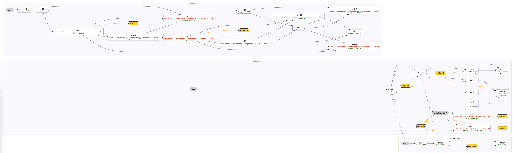

# render-argo-workflow

A small-ish python script that renders an [Argo workflow](https://argoproj.github.io/workflows/) as a [mermaid.js](https://mermaid.js.org) flowchart (embedded in a ready-to-view html page). Please be advised that not all Argo workflow features are supported.

### Usage

```
python ./render-workflows.py <output-html-file.html> <workflow-file-1.yaml> <workflow-file-2.yaml> ...
```

### Output sample


